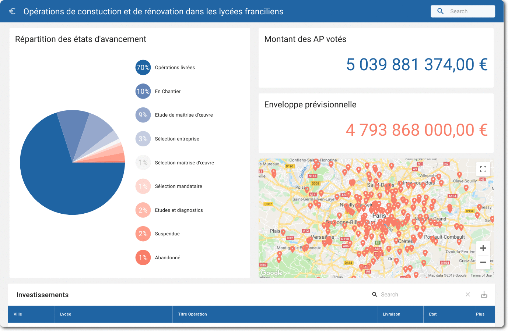

<h1 align="center">
    <br>
    
    <br>
    Paris High Schools Investments
    <br>
</h1>

<h4 align="center">KPI Intelligence - Full-stack developper test</h4>

<p align="center">
  
</p>

<p align="center">
  <a href="#project">Project</a> •
  <a href="#usage">Usage</a> •
  <a href="#license">License</a>
</p>

## Project

> Paris Region wants to have a web application to track the investments it makes for its high schools buildings. They provided you the dataset.json files containing the existing investments.

- [x] Build a REST API

- [x] Build a simple Web App

- [ ] Bonuses ? 💡

## Usage

_There are two options open to you:_

#### Use Docker and docker-compose
> Make sure you have already installed both [Docker Engine](https://docs.docker.com/install/) and [Docker Compose](https://docs.docker.com/compose/install/).

```sh
# Switch to docker-branch
$ git fetch --all && git checkout init-docker

# Launch it!
$ docker-compose build && docker-compose up

# Have a break and drink a coffee
```

#### Prefer the hand fashionned way
> Make sure you have already installed [mongo](https://docs.mongodb.com/manual/installation/)
```sh
# Launch MongoDB instance
$ mongod --dbpath /tmp/randomFolder

# Install API dependencies
$ cd api && yarn
$ yarn start

# Install client dependencies
$ cd client && yarn
$ yarn start
```

In both case, open your browser on [localhost:3000](http://localhost:3000)

## License

MIT

---
